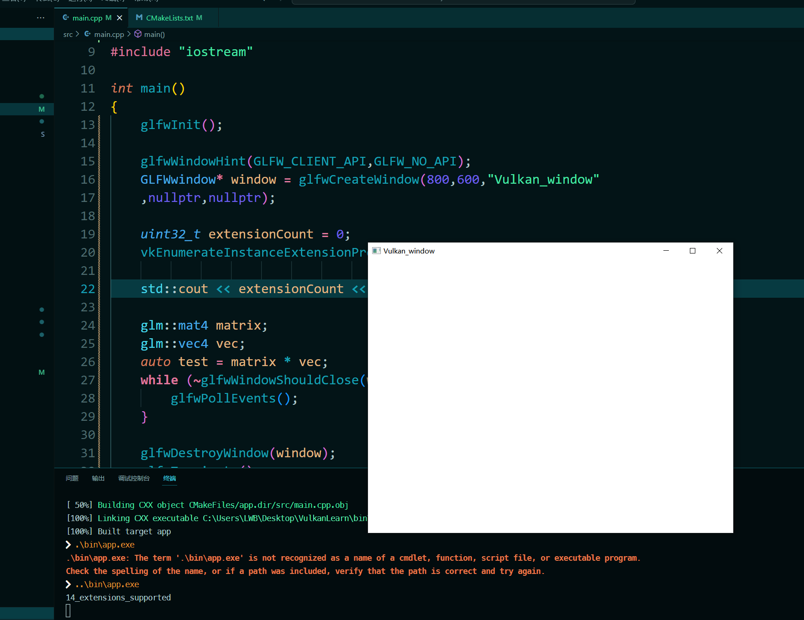

# VulkanFrame
Vulkan学习框架 :ok_hand:  
环境 `Windows MinGW` 其他环境需要更改`vendor/Vulkan`为其他版本  

准备工作:  
1. 在`vendor`创建`Vulkan`文件夹把Vulkan `include`,`Lib`粘贴进文件夹

2. 需要在`vendor/glfw`创建build文件 运行cmake
```
mkdir build
cmake . -G "MinGW Makefiles"  
make 
```
生成`Libglfw3.a` 对应cmake语句`link_directories(${PROJECT_SOURCE_DIR}/vendor/glfw/build/src)`

3. 在主项目(CMakeLists.txt) 创建文件夹`bin`和文件夹`build` 进入`build`文件夹之后执行以下命令:  
```
mkdir build
mkdir bin
cd build
cmake . -G "MinGW Makefiles" 
make
..\bin\app.exe
```
结果如下:   


## Vulkan
[检查VUlkan初始化 ](https://github.com/kabosusang/VulkanFrame/tree/VulkanInit)  
